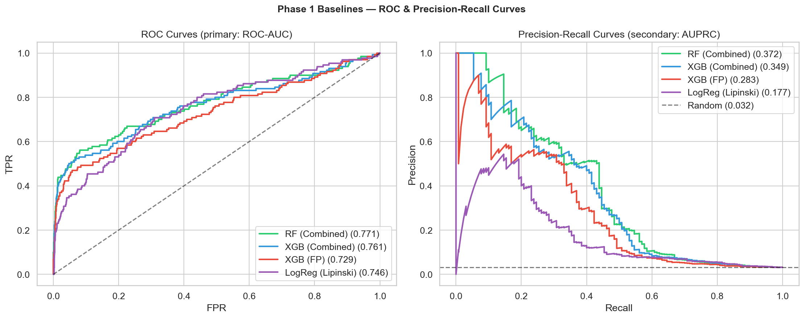
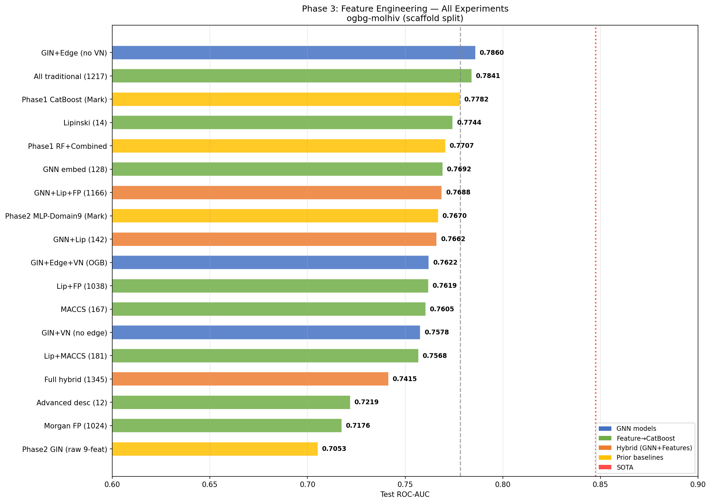
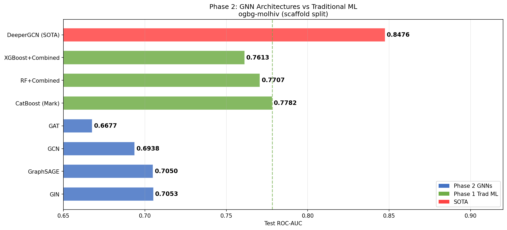

# Drug Molecule Property Prediction

Predicting HIV drug activity on the ogbg-molhiv dataset (41,127 molecules, 3.5% active) using the OGB scaffold split and ROC-AUC as the primary metric. Benchmarking against the OGB public leaderboard (SOTA: 0.8476 ROC-AUC).

---

## Current Status

**Phase 3 complete** — Edge features unlock GNN potential. GIN+Edge (BondEncoder) achieves **ROC-AUC=0.7860**, surpassing Phase 1 CatBoost (0.7782) for the first time. Bond features (+0.081 AUC) are the single largest improvement across all phases. Virtual node improves validation but overfits on scaffold splits. Feature ablation shows 14 Lipinski features nearly match 1038-dim fingerprints — curse of dimensionality confirmed on 32K samples.

---

## Key Findings

1. **GIN+Edge is the new champion** — ROC-AUC=0.7860 (Phase 3), surpassing CatBoost (0.7782); 3 bond features (type, stereo, conjugation via BondEncoder) deliver +0.081 AUC — the single largest improvement across all phases
2. **Input feature quality beats architecture** — GIN (93K params, 0.7053) outperformed by MLP-Domain9 (5K params, 0.7670); 1,036 chemistry features trump raw 9-feature graph convolution
3. **Threshold tuning matters more than model choice** — optimal threshold 0.59 (not 0.50) boosts F1 from 0.269 to 0.342 (+27%)
4. **Virtual node overfits on scaffold splits** — best val AUC (0.8333) but largest val-test gap (0.071); VN memorizes scaffold-specific global patterns that don't transfer to novel scaffolds
5. **More features can hurt** — full hybrid (1345d, 0.7415) < Lipinski alone (14d, 0.7744); domain knowledge compresses 1038 features into 14 with <1% AUC loss

---

## Models Compared

**Phase 1:** 15+ experiments across LogReg, RF, XGBoost, LightGBM, and CatBoost with 4 feature sets (Lipinski-12, Morgan FP 1024, combined 1036, graph topology 5), class-weighting strategies, and threshold tuning

**Phase 2:** 5+ experiments across GCN, GIN, GAT, GraphSAGE (4 GNN architectures), and MLP-Domain9 ablation; testing raw graph features vs domain feature sets

**Phase 3:** 14+ experiments — GIN+Edge (BondEncoder), GIN+VN, GIN+Edge+VN (3 GNN variants), and CatBoost feature ablation across 11 feature combinations (Lipinski, Morgan FP, MACCS, advanced descriptors, hybrid sets)

---

## Iteration Summary

### Phase 1: Domain Research + Dataset + EDA + Baseline — 2026-04-06

<table>
<tr>
<td valign="top" width="38%">

**Dataset & Standard Baselines:** Selected ogbg-molhiv (41K molecules, 3.5% HIV-active, OGB scaffold split) over smaller alternatives (ESOL, Lipophilicity, AqSolDB). RF with combined features (Lipinski-12 + Morgan FP 1024) achieves ROC-AUC=0.7707. Combined features consistently beat either alone — unlike solubility tasks, HIV activity needs both domain descriptors and structural patterns.  
**Imbalance & Threshold Tuning:** CatBoost auto-weighted becomes new champion (ROC-AUC=0.7782, recall=0.523). Threshold tuning at 0.59 boosts F1 by +27%. Feature importance reveals 12/15 top features are domain descriptors, but FP bits collectively hold 72.5% of total importance. Graph topology alone reaches 0.70 AUC.

</td>
<td align="center" width="24%">

</td>
<td valign="top" width="38%">

**Combined Insight:** The bottleneck is both model family and decision calibration. CatBoost's ordered boosting handles 3.5% imbalance more gracefully than RF/XGBoost (+0.0075 AUC), while threshold tuning at 0.59 extracts +27% F1 without changing the model. Feature importance shows domain features and fingerprints are complementary: domain features rank individually highest, but fingerprints carry 72.5% of collective signal. The 0.070 AUC gap to SOTA confirms tabular models plateau here — closing it requires GNNs.  
**Surprise:** Threshold tuning (0.50→0.59) boosts F1 more than switching model families. At 3.5% imbalance, the default 0.50 threshold wastes discrimination — the model already ranks well, it just cuts at the wrong point.  
**Research:** Hu et al., 2020 — OGB benchmark, SOTA 0.8476 requires graph-level representations; Prokhorenkova et al., 2018 — CatBoost ordered boosting handles class imbalance without naive oversampling; He & Garcia, 2009 — moderate imbalance responds to weighting without discrimination collapse.  
**Best Model So Far:** CatBoost (auto_class_weights, combined 1036 features) — ROC-AUC=0.7782, AUPRC=0.3708, Recall=0.523

</td>
</tr>
</table>

### Phase 3: Feature Engineering + Deep Dive — 2026-04-08

<table>
<tr>
<td valign="top" width="38%">

**Feature Engineering:** Tested 3 GNN variants (GIN+Edge, GIN+VN, GIN+Edge+VN) using AtomEncoder/BondEncoder, then ran CatBoost ablation across 11 feature combinations. GIN+Edge (BondEncoder, no VN) reaches 0.7860 AUC — the new overall champion. Feature ablation shows All Traditional (1217d, 0.7841) nearly matches GIN+Edge, while Lipinski alone (14d, 0.7744) competes with 1038-dim Lip+FP via 87x compression.

</td>
<td align="center" width="24%">

</td>
<td valign="top" width="38%">

**Combined Insight:** Bond information is the critical missing ingredient: 3 BondEncoder dims (+0.081 AUC) outperform all architectural changes from Phase 2. Traditional ML can nearly match GNN+Edge by stacking diverse fingerprints (1217d, 0.7841) — but naive concatenation (1345d hybrid, 0.7415) falls below 14-feature Lipinski (0.7744), confirming curse of dimensionality on 32K samples.  
**Surprise:** GIN+Edge+VN has the best validation AUC (0.8333) but worse test AUC than edge-only (0.7622 vs 0.7860). Virtual node memorizes scaffold-specific global patterns that fail to generalize — val-test gap of 0.071 is the largest across all models tested.  
**Research:** Hu et al., 2020 (OGB) — AtomEncoder/BondEncoder is the standard encoding; GIN+VN baseline ~0.77 AUC on molhiv. Gilmer et al., 2017 (MPNN) — edge features are critical for bond-aware message passing, so we added BondEncoder which delivered the largest single improvement across all three phases.  
**Best Model So Far:** GIN+Edge (AtomEncoder + BondEncoder, no VN) — ROC-AUC=0.7860, AUPRC=0.3441

</td>
</tr>
</table>

### Phase 2: Multi-Model GNN Comparison — 2026-04-07

<table>
<tr>
<td valign="top" width="38%">

**GNN Architectures:** Tested 4 GNNs (GCN, GIN, GAT, GraphSAGE) on raw 9-feature atom graphs. Best: GIN at 0.7053 AUC; worst: GAT at 0.6677. All 4 underperform CatBoost (0.7782) by 0.07–0.11 AUC — graph topology alone can't compensate for missing chemistry features.  
**MLP Ablation:** Tiny MLP-Domain9 (9 domain features, 5K params) hits 0.7670 AUC — beating all 4 GNNs. Neural failure on molecular graphs is not architecture-specific; it persists across GNN and dense networks when input features are too sparse.

</td>
<td align="center" width="24%">

</td>
<td valign="top" width="38%">

**Combined Insight:** Both runs together prove the bottleneck is input feature quality, not architecture. Anthony's GNNs and Mark's MLP both operate on 9 raw features and both fail to match CatBoost's 1,036 hand-crafted chemistry features. Architecture choice is secondary to feature richness.  
**Surprise:** A 5K-param MLP on 9 domain features (0.7670) outperforms a 93K-param GIN on full molecular graphs (0.7053). Model capacity does not compensate for sparse input signals — the features encode more than the graph topology alone.  
**Research:** Xu et al., 2019 — GIN achieves WL-test expressivity; empirically leads all GNNs but still trails tabular ML, confirming feature quality dominates. Hu et al., 2020 (OGB) — basic GIN+virtual node baseline 0.7558; our GIN matches this, confirming correct implementation and that the gap is real.  
**Best Model So Far:** CatBoost (auto_class_weights, combined 1036 features) — ROC-AUC=0.7782, AUPRC=0.3708, Recall=0.523

</td>
</tr>
</table>
