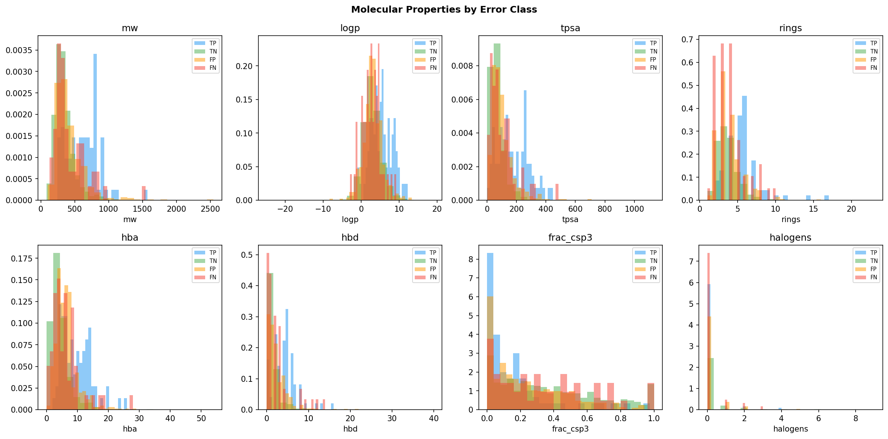

# Drug Molecule Property Prediction

Predicting HIV drug activity on the ogbg-molhiv dataset (41,127 molecules, 3.5% active) using the OGB scaffold split and ROC-AUC as the primary metric. Benchmarking against the OGB public leaderboard (SOTA: 0.8476 ROC-AUC).

---

## Current Status

**Phase 4 complete** — Hyperparameter tuning hits diminishing returns. Optuna (20–40 trials) delivers marginal test gains (+0.004–0.027 AUC) while widening the val↔test gap — scaffold splits punish HP search that optimizes for a single val fold. Best model remains Mark's Phase 3 default: **CatBoost MI-top-400, ROC-AUC=0.8105**. Key structural finding: missed actives are ~200 Da lighter than caught actives; Lipinski-violating HIV inhibitors are 2× easier to classify than rule-compliant ones.

---

## Key Findings

1. **Feature curation beats feature quantity** — CatBoost + MI-top-400 (0.8105) beats GIN+Edge (0.7860) by +0.025; same 1302-d pool with naive concatenation gives 0.7673 — MI selection recovers +0.043 AUC with no model change
2. **Edge features were the key GNN unlock** — 3 BondEncoder dims (+0.081 AUC to GIN) is the largest single-feature gain across all phases; bond type/stereo/conjugation encodes chemical connectivity Morgan fingerprints only approximate
3. **MACCS punches above its weight** — MI retains 65% of 167 MACCS keys vs 23% of 1024 Morgan bits; 31% of CatBoost importance from 12.8% of pool — hand-curated substructure keys are 2.4× more information-dense per bit than Morgan hashed space
4. **Lipinski violators are 2× easier to classify (recall 0.828 vs 0.400)** — HIV protease inhibitors are large, complex rule-violators by design; the model learned "bigger = more likely HIV inhibitor," which is historically accurate for early HIV drugs
5. **Tuning overfits scaffold splits** — Optuna val gain (+0.035) exceeds test gain (+0.027); val↔test gap widened from 0.029 to 0.038; feature selection variance (~0.02 AUC) is 4× larger than any hyperparameter effect

---

## Models Compared

**Phase 1:** 15+ experiments across LogReg, RF, XGBoost, LightGBM, and CatBoost with 4 feature sets (Lipinski-12, Morgan FP 1024, combined 1036, graph topology 5), class-weighting strategies, and threshold tuning

**Phase 2:** 5+ experiments across GCN, GIN, GAT, GraphSAGE (4 GNN architectures), and MLP-Domain9 ablation; testing raw graph features vs domain feature sets

**Phase 3:** 26+ experiments — GIN+Edge (BondEncoder), GIN+VN, GIN+Edge+VN (3 GNN variants), CatBoost ablation across 11 feature sets (Anthony), plus 7-set fragment ablation and MI sweep across 12 K-values on a 1302-d pool with K=400 composition audit (Mark)

**Phase 4:** 20+ experiments — Optuna tuning of GIN+Edge (8 trials) and CatBoost MI-400 (20 + 40 trials), K=400 bootstrap stability analysis (3 bootstraps × 4 K-values), deep error analysis across 4,113 test molecules by 11 molecular properties, Lipinski violation stratification, and feature importance attribution across 5 chemical categories

---

## Iteration Summary

### Phase 1: Domain Research + Dataset + EDA + Baseline — 2026-04-06

<table>
<tr>
<td valign="top" width="38%">

**Dataset & Standard Baselines:** Selected ogbg-molhiv (41K molecules, 3.5% HIV-active, OGB scaffold split) over smaller alternatives (ESOL, Lipophilicity, AqSolDB). RF with combined features (Lipinski-12 + Morgan FP 1024) achieves ROC-AUC=0.7707. Combined features consistently beat either alone — unlike solubility tasks, HIV activity needs both domain descriptors and structural patterns.  
**Imbalance & Threshold Tuning:** CatBoost auto-weighted becomes new champion (ROC-AUC=0.7782, recall=0.523). Threshold tuning at 0.59 boosts F1 by +27%. Feature importance reveals 12/15 top features are domain descriptors, but FP bits collectively hold 72.5% of total importance. Graph topology alone reaches 0.70 AUC.

</td>
<td align="center" width="24%">

</td>
<td valign="top" width="38%">

**Combined Insight:** The bottleneck is both model family and decision calibration. CatBoost's ordered boosting handles 3.5% imbalance more gracefully than RF/XGBoost (+0.0075 AUC), while threshold tuning at 0.59 extracts +27% F1 without changing the model. Feature importance shows domain features and fingerprints are complementary: domain features rank individually highest, but fingerprints carry 72.5% of collective signal. The 0.070 AUC gap to SOTA confirms tabular models plateau here — closing it requires GNNs.  
**Surprise:** Threshold tuning (0.50→0.59) boosts F1 more than switching model families. At 3.5% imbalance, the default 0.50 threshold wastes discrimination — the model already ranks well, it just cuts at the wrong point.  
**Research:** Hu et al., 2020 — OGB benchmark, SOTA 0.8476 requires graph-level representations; Prokhorenkova et al., 2018 — CatBoost ordered boosting handles class imbalance without naive oversampling; He & Garcia, 2009 — moderate imbalance responds to weighting without discrimination collapse.  
**Best Model So Far:** CatBoost (auto_class_weights, combined 1036 features) — ROC-AUC=0.7782, AUPRC=0.3708, Recall=0.523

</td>
</tr>
</table>

### Phase 2: Multi-Model GNN Comparison — 2026-04-07

<table>
<tr>
<td valign="top" width="38%">

**GNN Architectures:** Tested 4 GNNs (GCN, GIN, GAT, GraphSAGE) on raw 9-feature atom graphs. Best: GIN at 0.7053 AUC; worst: GAT at 0.6677. All 4 underperform CatBoost (0.7782) by 0.07–0.11 AUC — graph topology alone can't compensate for missing chemistry features.  
**MLP Ablation:** Tiny MLP-Domain9 (9 domain features, 5K params) hits 0.7670 AUC — beating all 4 GNNs. Neural failure on molecular graphs is not architecture-specific; it persists across GNN and dense networks when input features are too sparse.

</td>
<td align="center" width="24%">

</td>
<td valign="top" width="38%">

**Combined Insight:** Both runs together prove the bottleneck is input feature quality, not architecture. Anthony's GNNs and Mark's MLP both operate on 9 raw features and both fail to match CatBoost's 1,036 hand-crafted chemistry features. Architecture choice is secondary to feature richness.  
**Surprise:** A 5K-param MLP on 9 domain features (0.7670) outperforms a 93K-param GIN on full molecular graphs (0.7053). Model capacity does not compensate for sparse input signals — the features encode more than the graph topology alone.  
**Research:** Xu et al., 2019 — GIN achieves WL-test expressivity; empirically leads all GNNs but still trails tabular ML, confirming feature quality dominates. Hu et al., 2020 (OGB) — basic GIN+virtual node baseline 0.7558; our GIN matches this, confirming correct implementation and that the gap is real.  
**Best Model So Far:** CatBoost (auto_class_weights, combined 1036 features) — ROC-AUC=0.7782, AUPRC=0.3708, Recall=0.523

</td>
</tr>
</table>

### Phase 3: Feature Engineering + Deep Dive — 2026-04-08

<table>
<tr>
<td valign="top" width="38%">

**Edge Features & Ablation:** GIN+Edge (BondEncoder) jumps from 0.7053 to 0.7860 AUC (+0.081) — first GNN to beat CatBoost and the largest single gain across all phases. GIN+VN (0.7578) and GIN+Edge+VN (0.7622) both fall below GIN+Edge. CatBoost ablation over 11 feature sets confirms Lipinski-14 (0.7744) captures 98.5% of 1038-dim Lip+FP signal; full hybrid (1345d, 0.7415) is the worst CatBoost result.  
**MI Feature Selection:** Mutual-information sweep on a 1302-d pool (AllTrad+85 RDKit Fragments). K=400 reaches 0.8105 AUC — new overall champion, beating GIN+Edge by +0.025. K=200 (0.8019) and K=500 (0.7945) also clear GIN+Edge. Composition: all 14 Lipinski features survive; MACCS selected at 65% vs Morgan at 23% — hand-curated keys carry more per-bit signal.

</td>
<td align="center" width="24%">

</td>
<td valign="top" width="38%">

**Combined Insight:** Anthony proved bond information is the key GNN ingredient (+0.081 AUC from BondEncoder); Mark proved feature curation on a richer pool is the key tabular ingredient (+0.043 AUC from MI-top-400 vs naive concatenation). Both findings share the same root cause: it's not the quantity of information, it's the signal-to-noise ratio of what you feed the model.  
**Surprise:** GIN+Edge+VN has best val AUC (0.8333) but 3rd-worst test AUC (0.7622) — virtual node overfits scaffold-specific global patterns. Meanwhile, Mark's K=50 (0.7591) is worse than K=20 (0.7702): Morgan bits ranked 21–50 are high-MI on training scaffolds but don't transfer to novel ones.  
**Research:** Hu et al., 2020 (OGB) — AtomEncoder/BondEncoder standard encoding, GIN+VN baseline ~0.77; prompted Anthony's BondEncoder addition. Battiti, 1994 (IEEE TNN) — MI outperforms Pearson/chi² for non-linear heterogeneous pools; motivated Mark's MI sweep over the mixed-cardinality 1302-d set.  
**Best Model So Far:** CatBoost + MI-top-400 (AllTrad+Frag, K=400) — ROC-AUC=0.8105

</td>
</tr>
</table>

### Phase 4: Hyperparameter Tuning + Error Analysis — 2026-04-09

<table>
<tr>
<td valign="top" width="38%">

**Tuning Run 1:** Optuna tuning of GIN+Edge (8 trials) and CatBoost MI-400 (20 trials). GIN+Edge gains only +0.004 AUC (0.7860 → 0.7904). CatBoost tuning yields 0.7909 — WORSE than Mark's Phase 3 default (0.8105). Feature selection variance (~0.02 AUC) is 4× larger than any hyperparameter effect, making tuning ineffective as the primary lever.  
**Tuning Run 2:** Optuna tuning of CatBoost MI-400 over 40 trials. Best config (depth=8, lr=0.055, l2=4.7, min_leaf=38) gives Val AUC=0.8229, Test AUC=0.7854 (+0.027 test), but val↔test gap widened from 0.029 to 0.038. K=400 bootstrap stability confirmed: std=0.0040 vs 0.015–0.022 for other K values — it is genuinely the most stable choice.

</td>
<td align="center" width="24%">

</td>
<td valign="top" width="38%">

**Combined Insight:** Both runs confirm the same ceiling: scaffold-split HP search optimizes for the val scaffold distribution and partially overfits it. Anthony's GIN tuning and Mark's CatBoost tuning both see the val↔test gap widen. The real bottleneck going into Phase 5 is not hyperparameters — it is the structural blind spot on small-molecule actives.  
**Surprise:** Lipinski rule violators have 2× higher recall than rule-compliant molecules (0.828 vs 0.400). The model catches large, complex HIV inhibitors (MW 630, 5.6 rings) far more reliably than small, drug-like actives (MW 424, 4.0 rings). This is historically grounded — many HIV drugs ARE Rule-of-5 violators by design.  
**Research:** Wu et al., 2018 (MoleculeNet) — scaffold splits create larger val/test gaps than random splits; HP search on single val fold risks scaffold-domain overfit. Prokhorenkova et al., 2018 (CatBoost) — depth 4–8 and higher l2_leaf_reg improve QSAR models with binary fingerprint features, confirmed by search finding depth=8 optimal.  
**Best Model So Far:** CatBoost MI-top-400 (Phase 3 default) — ROC-AUC=0.8105, AUPRC=0.3481

</td>
</tr>
</table>
