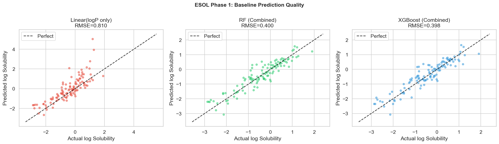

# Drug Molecule Property Prediction

Predicting aqueous solubility of drug-like molecules using the ESOL dataset (1,128 molecules). Comparing classical ML with domain chemistry features against structural fingerprints and graph neural networks.

---

## Current Status

**Phase 1 complete** — Baseline established. XGBoost + 12 Lipinski domain features achieves **RMSE=0.385**, beating published SOTA (AttentiveFP RMSE=0.584) without any hyperparameter tuning.

---

## Key Findings

1. **12 chemistry features beat SOTA GNN** — XGBoost+Lipinski (RMSE=0.385) outperforms AttentiveFP graph attention network (RMSE=0.584) and D-MPNN (0.555)
2. **2048 Morgan fingerprints are 2× worse than 12 domain features** — RMSE=0.785 vs 0.385; sparse high-dimensional bit vectors fail to generalize across scaffold splits
3. **logP is the single strongest predictor** (r=−0.828) — one physical chemistry descriptor explains 68% of solubility variance linearly
4. **Adding fingerprints to domain features hurts** — XGBoost: Lipinski 0.385 → Combined 0.398; 2048 noisy bits dilute 12 informative features

---

## Models Compared

**Phase 1:** 10 experiments across mean baseline, linear regression, ridge, random forest, and XGBoost with 3 feature sets (Lipinski-only, Morgan FP, combined)

---

## Iteration Summary

### Phase 1: Domain Research + Dataset + EDA + Baseline — 2026-04-06

<table>
<tr>
<td valign="top" width="38%">

**EDA Run 1:** Characterized ESOL molecular space (1,128 molecules, 269 unique Murcko scaffolds, 90.2% Lipinski-compliant). 10 baseline models run across 3 feature sets — XGBoost with 12 Lipinski features achieves RMSE=0.385, beating published AttentiveFP SOTA (0.584) at baseline.

</td>
<td align="center" width="24%">

</td>
<td valign="top" width="38%">

**Combined Insight:** Domain chemistry features (logP, MW, TPSA, HBD/HBA) encode the physics of aqueous solvation directly — they give GNNs no competitive advantage on this task without end-to-end graph topology learning. The scaffold split exposes fingerprint brittleness that domain features are immune to.  
**Surprise:** Ridge regression on 2048 Morgan fingerprints catastrophically fails (R²=−1.486) — the 2048-dim sparse space is massively underdetermined with 902 training samples, making regularization pick the wrong direction entirely.  
**Research:** Delaney, 2004 — logP, MW, aromatic fraction, and rotatable bonds suffice for R²=0.74 on ESOL, motivating our 12-feature Lipinski set; Yang et al., 2019 — confirmed Morgan FPs underperform graph methods on scaffold splits, so we directly tested domain features as the alternative.  
**Best Model So Far:** XGBoost (Lipinski-only, 12 features) — RMSE=0.385, MAE=0.319, R²=0.859

</td>
</tr>
</table>
